# Design Experiments

A Next.js-based sandbox for exploring visual design systems, widgets, and interactive patterns.

> **Heads up:** This is a personal sandbox -- me coding in public. Experiments get added, removed, and rewritten all the time. Feel free to browse, but don't depend on anything here staying put.

This is a design sketchbook, not production software. There's no test suite and that's intentional -- the point is rapid experimentation and learning in public, not shipping stable APIs. Things break, get rewritten, and disappear without notice.

---

## Local Setup

Most experiments are self-contained client-side toys and need nothing beyond:

```bash
npm install
npm run dev
```

Some experiments call external services (the first of these is **Monono**, which talks to Claude Haiku). For those, copy the example env file and fill in the keys you need:

```bash
cp .env.local.example .env.local
```

Current env vars used:

- `VERCEL_AI_GATEWAY_KEY` — required by Monono. AI experiments route through [Vercel AI Gateway](https://vercel.com/ai-gateway), which fronts Anthropic and other providers with a unified API, spend dashboard, and per-project budgets. Create a key in the Vercel dashboard and set a budget cap there
- `UPSTASH_REDIS_REST_URL` + `UPSTASH_REDIS_REST_TOKEN` — optional for local dev (rate limiting is disabled without them), required in production. Free tier at [upstash.com](https://upstash.com/) is plenty

Experiments degrade gracefully without their keys set — Monono, for example, shows in-character "brain glitched" fallback messages instead of returning errors.

---

## Experiments

### Water Mesh

**June 10, 2026**

[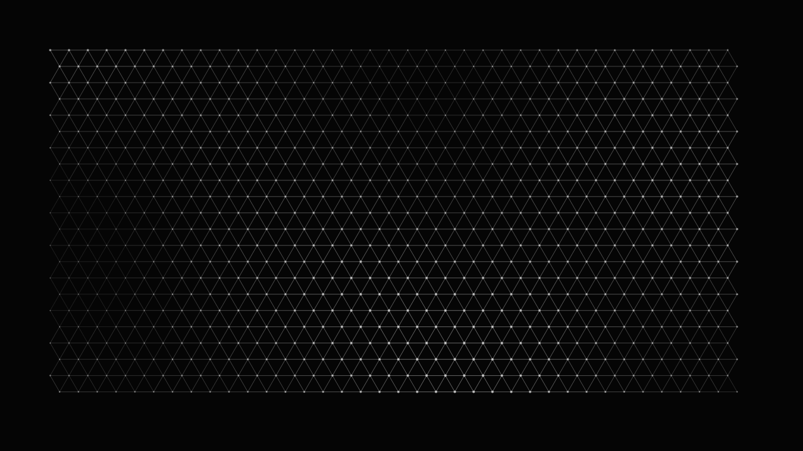](/design-experiments/water-mesh)

A hexagonal mesh viewed from directly above. Nodes are fixed in the plane; clicking pushes them toward you in Z, shift-clicking dents them away at 3× force. The perspective camera turns Z displacement into foreshortening — dents compress the cells, extrusions expand them. Deformations decay back to flat over about seven seconds via linear decay (5 units/frame). Weak Z neighbor coupling keeps the surface coherent without over-smoothing. Pure canvas 2D API, no libraries.

`Canvas` `Physics` `Interactive` `3D` `Generative`

**[View Live →](https://www.joshcoolman.com/design-experiments/water-mesh) | [View Code →](https://github.com/joshcoolman/sandbox/tree/main/app/design-experiments/water-mesh)**

---

### Step Sequencer

**May 27, 2026**

[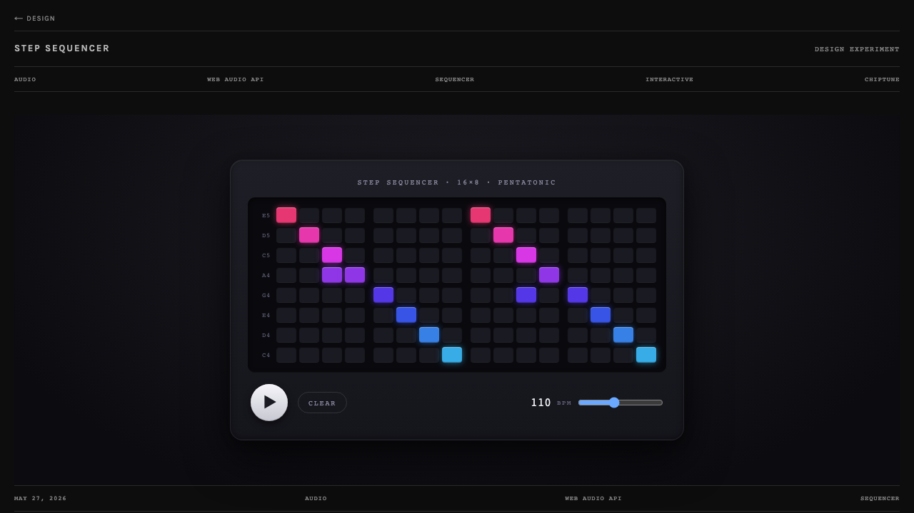](/design-experiments/step-sequencer)

A Tenori-on / ToneMatrix-flavored grid sequencer. Sixteen 16th-note steps wide, eight pads tall, with each row tuned to a note in the C major pentatonic — meaning any combination of toggled cells sounds musical, no piano skills required. The playhead sweeps left to right and lit pads fire chiptune square-wave notes; rows are color-coded warm-to-cool top-to-bottom so the grid reads like a rainbow when filled. Pure Web Audio API — lazy AudioContext, oscillator + gain envelope per note, setInterval lookahead scheduler. No deps, no audio assets. Variable tempo from 60 to 180 BPM.

`Audio` `Web Audio API` `Sequencer` `Interactive` `Chiptune`

**[View Live →](https://www.joshcoolman.com/design-experiments/step-sequencer) | [View Code →](https://github.com/joshcoolman/sandbox/tree/main/app/design-experiments/(experiments)/step-sequencer)**

---

### Slide Gallery

**May 24, 2026**

[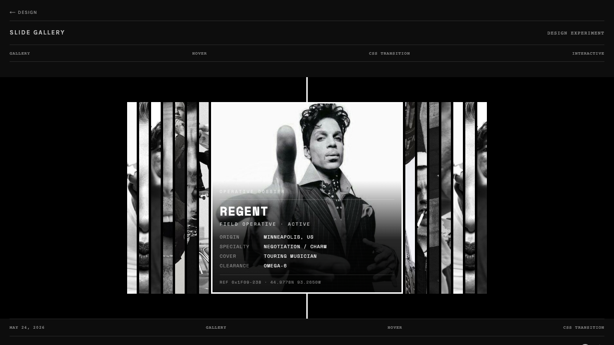](/design-experiments/slide-gallery)

An expanding-panel gallery on black. A row of thin vertical slivers — each a center slice of a black-and-white photograph — opens as you move across it. Hover (or tap, on mobile) and the focused panel widens to the full frame while the whole strip slides to keep it centered, and a white spotlight frame snaps over it with beams shooting to the top and bottom of the stage. The focused panel then decodes a made-up special-ops dossier in its lower third: every field churns through random glyphs and locks in top-to-bottom, like a Mission Impossible terminal readout. Pure layout math and a slow cubic-bezier ease; no animation library. Reproduced from a video, screenshot by screenshot.

`Gallery` `Hover` `CSS Transition` `Interactive`

**[View Live →](https://www.joshcoolman.com/design-experiments/slide-gallery) | [View Code →](https://github.com/joshcoolman/sandbox/tree/main/app/design-experiments/(experiments)/slide-gallery)**

---

### Ripple Cycle

**May 13, 2026**

[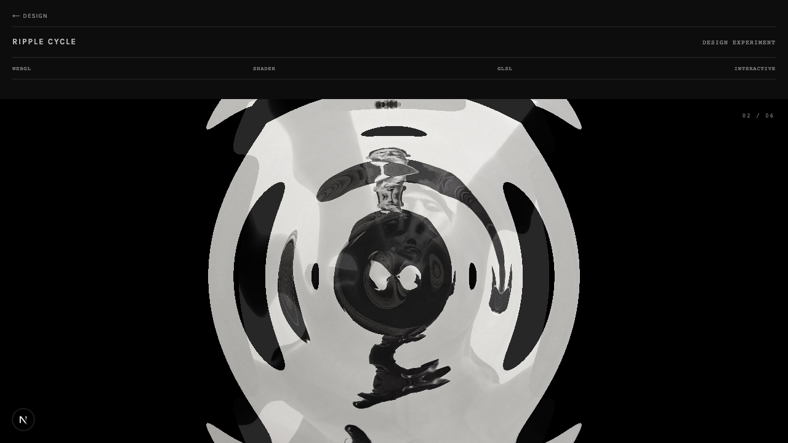](/design-experiments/ripple-cycle)

Six black-and-white photographs sit on black. Click anywhere and a circular ripple radiates from that exact point, distorting the surface while the next image cross-fades through. Vanilla WebGL2 + GSAP — a fragment shader displaces UVs along a radial sine wave with a sin(π·t) falloff so the surface returns clean every cycle. Click coordinates flow into a `uOrigin` uniform so every ripple emanates from your finger, not a fixed center.

`WebGL` `Shader` `GLSL` `Interactive`

**[View Live →](https://www.joshcoolman.com/design-experiments/ripple-cycle) | [View Code →](https://github.com/joshcoolman/sandbox/tree/main/app/design-experiments/(experiments)/ripple-cycle)**

---

### Kobold Blaster

**May 13, 2026**

[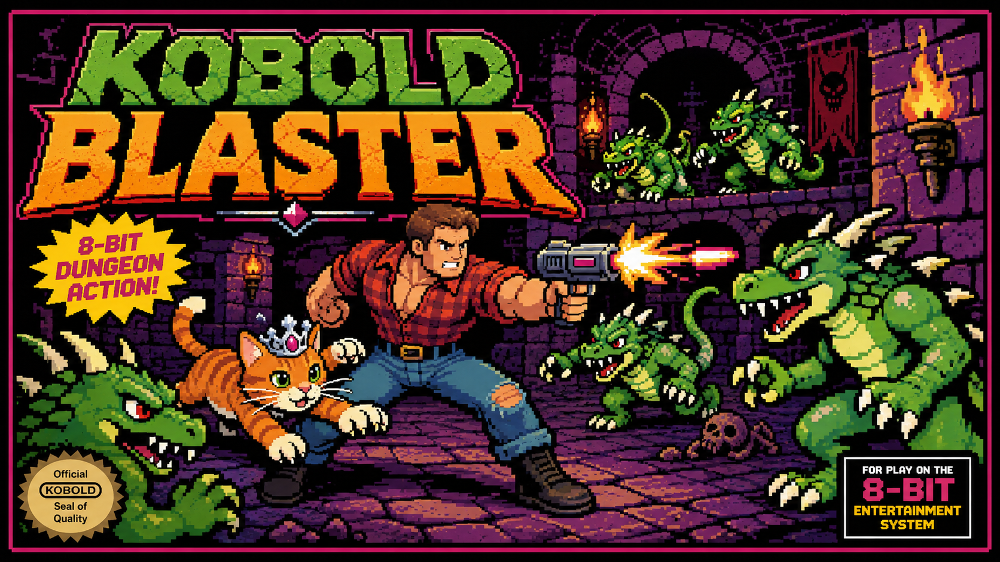](/design-experiments/kobold-blaster)

An 80s/90s horde shooter starring Carl and Princess Donut from the Dungeon Crawler Carl book series. Carl throws bombs, Donut judges everyone. Waves of kobolds swarm from all edges — chain explosions, gore particles, animated skull death sequences, and LitRPG system notifications between waves.

**The real experiment is the pipeline, not the game.** Two AI systems built this, and they never talked to each other.

Claude Code wrote everything: the canvas game loop, a sprite rendering system with per-frame tight crops, enemy pathfinding and AI companion behavior, bomb physics, chain explosions, combo scoring, CRT overlay. GPT-image-1 painted everything: each character described as a natural-language prompt, returned as a 4×4 sprite sheet on solid magenta, chroma-keyed at runtime, with a pixel scanner to derive the exact crop bounds per frame. Multiple generations per character (v1 and v2 sprites survive in the git history). The death sequence — four animated skull rows, randomized per kill, accumulating on the arena floor — was the last asset added.

The code pipeline and the art pipeline ran completely in parallel. Neither system touched what the other handled. They fit together cleanly.

`Game` `Canvas` `Pixel Art` `GPT-image-1` `Claude Code`

**[View Live →](https://www.joshcoolman.com/design-experiments/kobold-blaster) | [View Code →](https://github.com/joshcoolman/sandbox/tree/main/app/design-experiments/(experiments)/kobold-blaster)**

---

### Leaderboard

**April 27, 2026**

[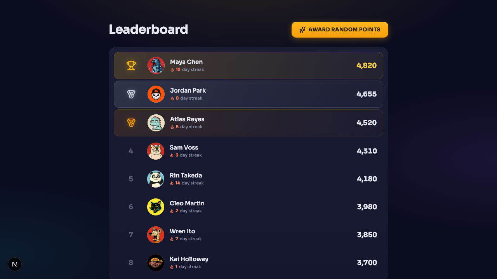](/design-experiments/leaderboard)

A playful leaderboard with eight runners, illustrated avatars, and gold/silver/bronze trophies for the top three. Hovering a row bubbles its avatar up with a rubber-band spring; clicking opens a profile modal with stats, a weekly bar chart, and badge pills — the modal avatar pops in with a heavier overshoot and the rank badge stamps in after. The "Award random points" button picks one to three players, animates each score pop, and lets the rows spring to their new positions. Built on Motion's `layout` prop — the reorder choreography is essentially free.

`Motion` `Leaderboard` `Layout Animation` `Profile Modal`

**[View Live →](https://www.joshcoolman.com/design-experiments/leaderboard) | [View Code →](https://github.com/joshcoolman/sandbox/tree/main/app/design-experiments/(experiments)/leaderboard)**

---

### ASCII Reveal

**April 26, 2026**

[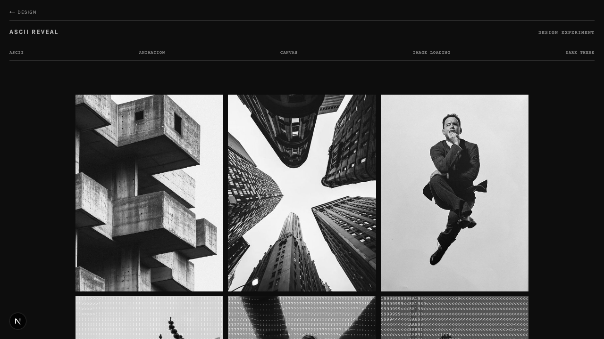](/design-experiments/ascii-reveal)

Six portrait photos materialize from ASCII art — pixel brightness mapped to characters that scramble and resolve before the photograph fades in. Cards stagger on load; click any image to replay it, click the background to replay all. Idle-aware: a random card quietly re-animates every few seconds when the page is left alone.

**[View Live →](/design-experiments/ascii-reveal)**

---

### Monono

**April 16, 2026**

[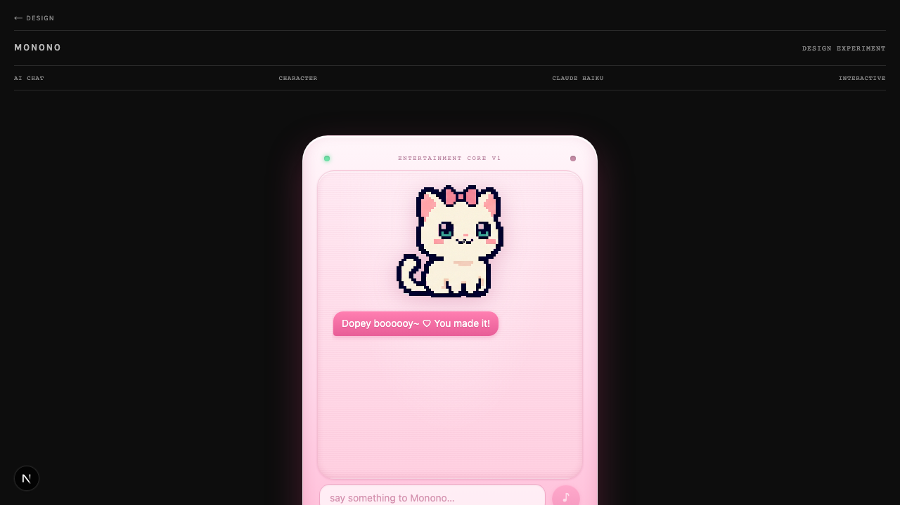](https://www.joshcoolman.com/design-experiments/monono)

A sparkly J-pop idol AI trapped inside a cheap entertainment device. Chat with Monono Aware — cute, playful, sarcastic, and constitutionally incapable of being serious. Deflects real questions with songs, nicknames you "dopey boy," and abruptly signs off mid-sentence when bored. Claude Haiku backend with per-session budget caps (Upstash Redis) so one smitten user can fall in love without bankrupting the site. Inspired by the AI character in M.R. Carey's *Book of Koli*.

`AI Chat` `Character` `Claude Haiku` `Interactive`

**[View Live →](https://www.joshcoolman.com/design-experiments/monono) | [View Code →](https://github.com/joshcoolman/sandbox/tree/main/app/design-experiments/(experiments)/monono)**

---

### Camera Rig

**April 2026**

[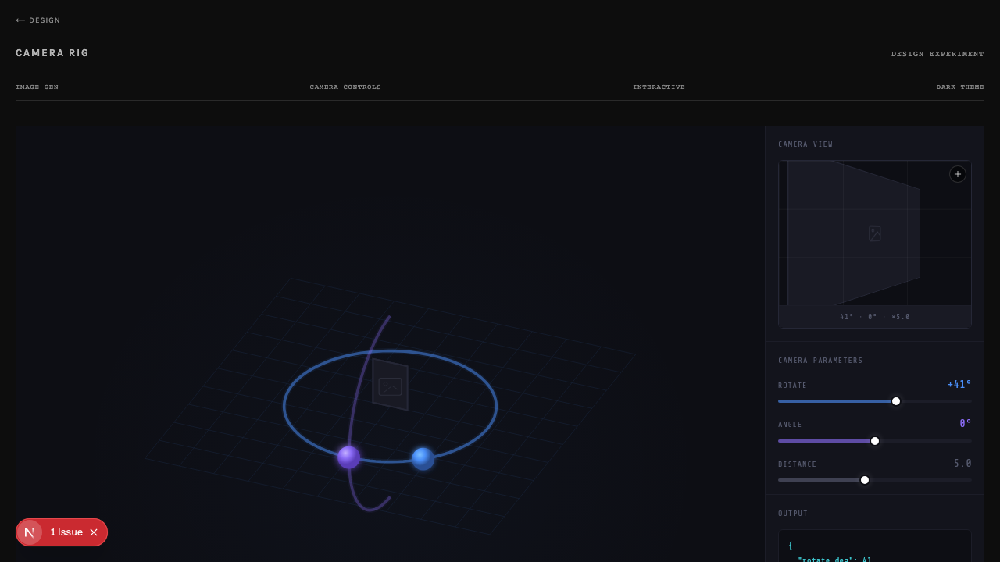](https://www.joshcoolman.com/design-experiments/camera-rig)

Virtual camera controller for image generation workflows. Upload a source image and orbit a virtual camera around the subject — adjusting azimuth, elevation, and distance. Outputs JSON camera parameters for models like Zero123-XL, SV3D, and Era3D. Interactive SVG 3D viewport with draggable orbit spheres, perspective camera preview, and real-time parameter sliders.

`3D` `Camera Controls` `Image Generation` `Interactive` `Dark Theme`

**[View Live →](https://www.joshcoolman.com/design-experiments/camera-rig) | [View Code →](https://github.com/joshcoolman/sandbox/tree/main/app/design-experiments/(experiments)/camera-rig)**

---

### Moodboard

**March 22, 2026**

[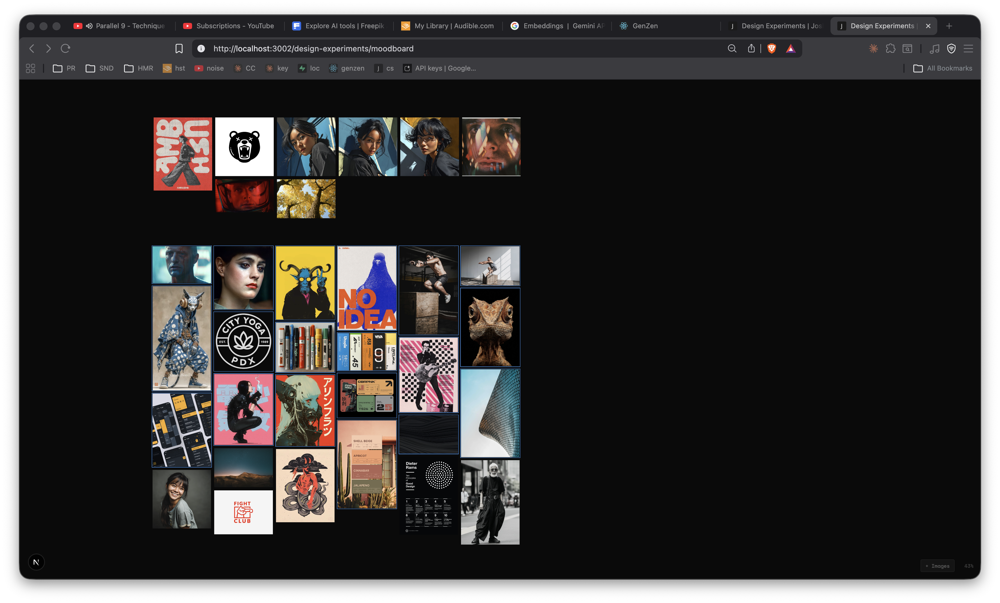](https://www.joshcoolman.com/design-experiments/moodboard)

Infinite canvas for visual brainstorming. Paste, drop, or upload images and arrange them freely on a dark canvas. Pan with Space+drag, zoom with scroll wheel toward cursor, marquee select by dragging, multi-select with Shift. Batch imports lay out in masonry columns. All local-first -- images persist as data URLs in IndexedDB, nothing uploaded. Built with custom pan/zoom transform math and hotkeys-js.

`Infinite Canvas` `Local-First` `Interactive` `Dark Theme`

**[View Live →](https://www.joshcoolman.com/design-experiments/moodboard) | [View Code →](https://github.com/joshcoolman/sandbox/tree/main/app/design-experiments/moodboard)**

---

### Image to UI

**March 8, 2026**

[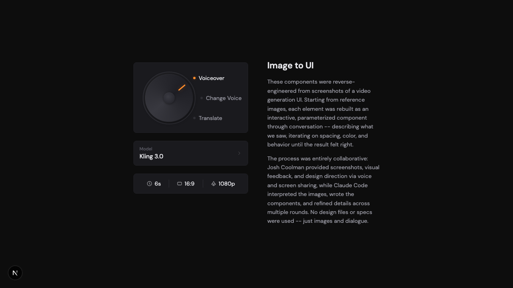](https://www.joshcoolman.com/design-experiments/image-to-ui)

Interactive components reverse-engineered from screenshots of a video generation UI. Starting from reference images, each element was rebuilt as a parameterized component through conversation -- describing what we saw, iterating on spacing, color, and behavior until the result felt right. Rotary selector, model picker, duration slider, aspect ratio and quality selectors, all sharing dark-theme design tokens. No design files or specs -- just images and dialogue.

`Components` `Interactive` `Dark UI` `Animation`

**[View Live →](https://www.joshcoolman.com/design-experiments/image-to-ui) | [View Code →](https://github.com/joshcoolman/sandbox/tree/main/app/design-experiments/image-to-ui)**

---

### Candy Icons

**March 4, 2026**

[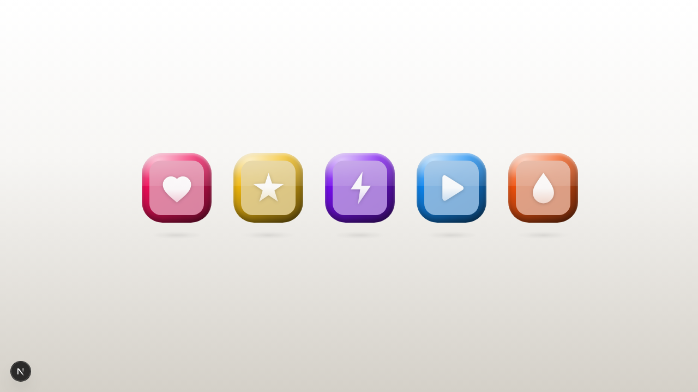](https://www.joshcoolman.com/design-experiments/candy-icons)

Five 3D app icons crafted from pure CSS and SVG. Each squircle shell uses a four-layer gradient stack driven by a single --hue custom property. Icons feature spring-bounce hover animations with staggered glyph and floor-shadow physics. Inner glyphs carry a subtle vertical hue gradient — near-white at the top, softly tinted at the bottom. No 3D libraries, no canvas — just gradients and springs.

`SVG` `CSS Gradients` `Specular` `3D Icons`

**[View Live →](https://www.joshcoolman.com/design-experiments/candy-icons) | [View Code →](https://github.com/joshcoolman/sandbox/tree/main/app/design-experiments/candy-icons)**

---

### Card Stack

**March 2, 2026**

[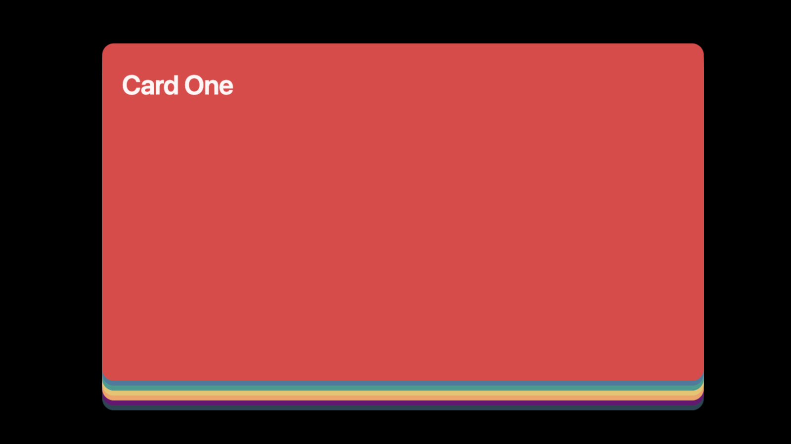](https://www.joshcoolman.com/design-experiments/card-stack)

Scroll-driven card stack with seven colored cards. Scroll peels cards off the top to reveal the next, with opacity fade-out as cards clear the stack. Each card expands to fullscreen with a GSAP-powered zoom transition. Click to expand, click to collapse. URL deep-linking with `?card=N`. Built with GSAP ScrollTrigger, Lenis smooth scroll, and a separate overlay approach to avoid transform-containment issues. Responsive -- 85vw on mobile, 67vw on desktop.

`GSAP` `Scroll Animation` `Cards` `Interactive`

**[View Live →](https://www.joshcoolman.com/design-experiments/card-stack) | [View Code →](https://github.com/joshcoolman/sandbox/tree/main/app/design-experiments/card-stack)**

---

### Retro Bento

**February 23, 2026**

[](https://www.joshcoolman.com/design-experiments/retro-bento)

What if CrossFit Bento and Retro Tech had a baby? The interactive widget layout of CrossFit Bento meets the brushed aluminum, LCD panels, and tactile controls of Retro Tech. Nine fictional hardware modules -- temporal gauge with animated needle, flux capacitor with stacked LCD readouts, spectral analyzer VU meters, neural pathways LED dot matrix with staggered animations, entropy engine with escalating states, phase scope with rotating arc chart, memory bank with fader-driven scroll, resonance monitor with zone bars, and stasis chamber. All controls are interactive -- knobs drag horizontally, toggles glow orange, and tapping panels randomizes values with buttery smooth transitions.

`Bento Grid` `Hardware UI` `CRT Display` `SVG Animation`

**[View Live →](https://www.joshcoolman.com/design-experiments/retro-bento) | [View Code →](https://github.com/joshcoolman/sandbox/tree/main/app/design-experiments/(experiments)/retro-bento)**

---

### Retro Tech Control Panel

**February 20, 2026**

[](https://www.joshcoolman.com/design-experiments/retro-tech)

Hardware-inspired control panel rendered in CSS. Aluminum chassis with corner screws, OLED-style display with animated segmented LED meters, rotary knobs with drag interaction, vertical faders, toggle switches, tactile buttons, and a self-filling perf-grid speaker grille. Inspired by Teenage Engineering TP-7/TX-6, Braun noise gate pedal, and Work Louder numpad. DM Mono labels with Archivo Narrow model name. Warm gray surface palette with single orange accent.

**Tags:** Hardware UI - Neumorphic - Interactive Controls - CSS Animation

**[View Live →](https://www.joshcoolman.com/design-experiments/retro-tech) | [View Code →](https://github.com/joshcoolman/sandbox/tree/main/app/design-experiments/retro-tech)**

---

### CrossFit Bento

**February 20, 2026**

[](https://www.joshcoolman.com/design-experiments/crossfit-bento)

Dark bento grid dashboard for CrossFit training data. Nine widget cards covering goal progress, calorie tracking, weekly training load bar chart, GitHub-style activity heatmap with flame icons on peak days, WOD stats, macro donut chart, exercise log with PR badges, heart rate zones, and sleep stages. DM Sans body with Geist Pixel Square for technical labels. Matte finish palette -- orange, olive, brown accents on near-black.

**Tags:** Bento Grid - Dashboard - Geist Pixel - Dark Theme

**[View Live →](https://www.joshcoolman.com/design-experiments/crossfit-bento) | [View Code →](https://github.com/joshcoolman/sandbox/tree/main/app/design-experiments/crossfit-bento)**

---

### Sticky Notes

**February 18, 2026**

[](https://www.joshcoolman.com/design-experiments/sticky-notes)

Interactive sticky note stack component. Post-it notes rendered from markdown files with swipe-to-cycle animation, color variants (warm, cool, neutral), and Permanent Marker handwriting font. Click to expand, click to cycle, Escape to close. Portable design -- consumer passes a notes directory path, so any page can use it with its own content. Currently used by the blog for "note to self" thoughts.

**Tags:** Component - CSS Animation - Markdown Content - Portable

**[View Live →](https://www.joshcoolman.com/design-experiments/sticky-notes) | [View Code →](https://github.com/joshcoolman/sandbox/tree/main/app/design-experiments/sticky-notes)**

---

### Contact Sheet

**February 17, 2026**

[](https://www.joshcoolman.com/design-experiments/contact-sheet)

Image folder browser for building file lists to share with LLMs. Pick a folder, click images to select them, and a sidebar shows your selections with thumbnails. Copy the filename list to clipboard with one click. Designed for the workflow of visually identifying images then telling an LLM which ones to work with. Everything runs client-side -- nothing gets uploaded.

**Tags:** Utility - File API - Client-Side - Dark Theme

**[View Live →](https://www.joshcoolman.com/design-experiments/contact-sheet) | [View Code →](https://github.com/joshcoolman/sandbox/tree/main/app/design-experiments/contact-sheet)**

---

### Font Pairings

**February 15, 2026**

[](https://www.joshcoolman.com/design-experiments/font-pairings)

A collection of 40 curated Google Font pairings, each displayed on its own color-palette card. Click any card to copy an LLM-ready specification prompt. Includes superfamily pairings, monospace+sans combos, and brand design system fonts. Avoids overused defaults -- no Montserrat, Roboto, Open Sans, Lato, Playfair Display, Raleway, Poppins, or Inter. Static HTML with inline CSS, no framework.

**Tags:** Typography - Font Pairings - Static HTML - Copy-to-Clipboard

**[View Live →](https://www.joshcoolman.com/design-experiments/font-pairings) | [View Code →](https://github.com/joshcoolman/sandbox/tree/main/app/design-experiments/font-pairings)**

---

### Modular Grid

**February 14, 2026**

[](https://www.joshcoolman.com/design-experiments/modular-grid)

Swiss-inspired modular grid system for digital surfaces. 8px base unit, 4-column layout with proportional margins and gutters, strict vertical rhythm. Includes toggleable cyan grid overlay, type specimen, image treatment demos, and system spec table. Dark mode adaptation of a print-precision layout methodology originally built in Claude Desktop.

**Tags:** Grid System - Swiss Design - Dark Mode - Typography

**[View Live →](https://www.joshcoolman.com/design-experiments/modular-grid) | [View Code →](https://github.com/joshcoolman/sandbox/tree/main/app/design-experiments/modular-grid)**

---

### Day at a Glance

**February 12, 2026**

[](https://www.joshcoolman.com/design-experiments/day-at-a-glance)

Time-aware workday timeline with a dynamic now-line that tracks real time. Features a 9am-5pm schedule with colored event bars that partially fill as the hour progresses -- gray above the now-line, color below. Past events auto-dim. Built with CSS grid, inline linear-gradient for the fill effect, and 60-second interval updates.

**Tags:** CSS Grid - Timeline - Dynamic State - Dark Theme

**[View Live →](https://www.joshcoolman.com/design-experiments/day-at-a-glance) | [View Code →](https://github.com/joshcoolman/sandbox/tree/main/app/design-experiments/day-at-a-glance)**

---

### CrossFit Design Challenge

**February 9, 2026**

[](https://www.joshcoolman.com/design-experiments/crossfit-challenge)

Four AI personas -- brutal/industrial, minimal/refined, editorial/magazine, and tech/data-forward -- each designed a CrossFit homepage for IRON REPUBLIC gym. Dark mode across all designs, meaningful animation (glitch effects, scroll reveals, chart animations), and data visualization (SVG charts, radial indicators, bar graphs). Pure CSS animations, no external libraries.

**Tags:** Dark Mode - CSS Animation - Data Viz - Agent Teams

**[View Live →](https://www.joshcoolman.com/design-experiments/crossfit-challenge) | [View Code →](https://github.com/joshcoolman/sandbox/tree/main/app/design-experiments/crossfit-challenge)**

---

### Terminator - Text Scramble

**February 6, 2026**

[](https://www.joshcoolman.com/design-experiments/terminator)

Interactive terminal-style text scramble effect with two-phase animation. Enter custom text to see it scramble chaotically for 1 second, then resolve sequentially line-by-line. Features balanced line breaking and automatic uppercase conversion. Default text: Ghost in the Shell quote on identity and consciousness.

**Tags:** Text Animation - Terminal UI - Interactive - Split-Flap Effect

**[View Live →](https://www.joshcoolman.com/design-experiments/terminator) | [View Code →](https://github.com/joshcoolman/sandbox/tree/main/app/design-experiments/terminator)**

---

### Brand Guidelines

**February 6, 2026**

[](https://www.joshcoolman.com/design-experiments/brand-guidelines)

Interactive brand guidelines with live color and typography customization. Features animated Activity line chart and Analytics bar chart widgets with CSS-only animations. Click the gear icon for a push-in sidebar with color pickers using Chroma.js scale generation and 9 curated font pairings. All changes persist via localStorage.

**Tags:** React Components - Animated Charts - Color Systems - Typography

**[View Live →](https://www.joshcoolman.com/design-experiments/brand-guidelines) | [View Code →](https://github.com/joshcoolman/sandbox/tree/main/app/design-experiments/brand-guidelines)**

---

### Blend

**February 2, 2026**

[](https://www.joshcoolman.com/design-experiments/blend)

Swiss modernist gradient specimen system featuring organic mesh gradients via SVG blur technique. Includes 27 gradient cards across linear and mesh styles, systematic labeling (G-01 through G-09, M-01 through M-18), scroll-triggered animations, and an analytics dashboard mockup.

**Tags:** Gradients - SVG Mesh - Swiss Design - Scroll Animation

**[View Live →](https://www.joshcoolman.com/design-experiments/blend) | [View Code →](https://github.com/joshcoolman/sandbox/tree/main/app/design-experiments/blend)**

---

## Development

```bash
npm run dev    # Start Next.js dev server on port 3000
npm run build  # Build for production
npm start      # Run production build
```

## Blog

The site includes a markdown-powered blog at [joshcoolman.com/blog](https://www.joshcoolman.com/blog) with posts on design, AI agents, and working with code. Posts live in `blog/` as `.md` files with frontmatter.

**[View Blog →](https://www.joshcoolman.com/blog)**

---

## Recommended

A curated collection of links -- YouTube videos, GitHub repos, and web tools -- with personal commentary and auto-fetched thumbnails. New links are added via the `/link` skill. Each item is a markdown file with frontmatter (url, date, optional title) and a one-line comment.

Thumbnails resolve automatically at build time: YouTube via oEmbed, GitHub via OG images, and web links via manual screenshots taken with agent-browser.

**[View Recommended →](https://www.joshcoolman.com/recommended)**

---

## Docs

Internal documentation and reference material rendered at [joshcoolman.com/docs](https://www.joshcoolman.com/docs). Markdown files in `docs/` with sidebar navigation, syntax highlighting, and table of contents.

**[View Docs →](https://www.joshcoolman.com/docs)**

---

## About

A self-published architectural review of this repo lives at [joshcoolman.com/about](https://www.joshcoolman.com/about) — shape of the app, gallery patterns, per-experiment notes, cross-cutting concerns, and a key file map. The page is a one-time port of an artifact generated by the `/explore-repo` Claude skill (`~/repos/sandbox-analysis.html`); refresh by re-running the skill and re-porting the new HTML into `app/about/page.tsx`. The skill is not part of this repo.

**[View About →](https://www.joshcoolman.com/about)**

---

## Structure

```
/
├── app/                          # Next.js App Router
│   ├── page.tsx                  # Homepage
│   ├── layout.tsx                # Root layout with SEO metadata
│   ├── sitemap.ts                # Dynamic sitemap
│   ├── robots.ts                 # Crawler rules
│   ├── design-experiments/
│   │   ├── page.tsx              # Experiments gallery
│   │   └── [experiment]/         # Each experiment is a self-contained route
│   ├── (blog)/blog/              # Blog index and post pages
│   ├── (blog)/recommended/       # Recommended links page
│   ├── (blog)/notes/             # Sticky note markdown files
│   ├── (docs)/docs/              # Docs viewer with sidebar nav
│   └── about/                    # Architectural review page (ported from /explore-repo)
├── lib/
│   ├── experiments/data.ts       # Shared experiments metadata
│   ├── blog/                     # Blog loader and types
│   └── docs/                     # Docs loader and utilities
├── blog/                         # Markdown blog posts
├── docs/                         # Markdown documentation
├── public/
│   └── screenshots/              # Preview images for README
└── CLAUDE.md                     # Development workflow
```

## Adding New Experiments

1. Create `app/design-experiments/[name]/page.tsx` with your React component
2. Add screenshot to `public/screenshots/[name].png`
3. Add experiment to `lib/experiments/data.ts`
4. Update this README with experiment details

---

## Security Scanning

`.deepsec/` contains a [deepsec](https://github.com/vercel/deepsec) workspace configured to scan this repo. Scan output is gitignored — only the config and `data/sandbox/INFO.md` (project context for the AI) are committed.

```bash
cd .deepsec
pnpm deepsec scan    --project-id sandbox   # run matchers, find candidates
pnpm deepsec process --project-id sandbox   # AI investigates candidates
pnpm deepsec report  --project-id sandbox   # print findings summary
```

`process` is slow (AI reads code in batches) — run it in the background or expect ~45 min for a full pass.

---

## Claude Code Skills

This repo includes custom skills for [Claude Code](https://claude.ai/code) that streamline common development workflows. While not all skills are specific to this sandbox project, they're general-purpose utilities I use across different projects.

### Available Skills

**Design Experiment Pipeline:**

**`/sketch`**
Rapid visual prototyping -- paint with code. Two files (page.tsx + styles.css), plain CSS with descriptive class names, no component libraries, no data layer. The napkin drawing before the architecture.

**`/design-experiment`**
Create a new design experiment in the sandbox. Scaffolds the route, page, and styles following project conventions.

**`/design-audit`**
Audit a design experiment's CSS for color and type consistency. Extracts every color and font-size, flags near-duplicates, suggests unifications. Interactive -- select which fixes to apply.

**`/animation-audit`**
Audit a design experiment for entrance animations, stagger timing, and interaction feedback. Proposes spring presets for consistency and wires up click-to-replay.

**`/ts-handoff`**
Light TypeScript cleanup to make components handoff-ready. Catches real bugs and hygiene issues without over-engineering. The final pass before shipping.

**`/promote`**
Make a design experiment importable. Runs the full quality pipeline, extracts components, designs a public API, and creates a barrel export.

**`/ship-experiment`**
Ship a design experiment: screenshots with agent-browser, updates gallery and README, commits and pushes to GitHub.

**Content:**

**`/link`**
Add a link to the Recommended page. Pass a URL and a comment -- the skill detects the source type (YouTube, GitHub, web), creates a markdown file, handles screenshots for web links, and runs a production build to trigger thumbnail downloads.

**`/blog-post`**
Draft a blog post from conversation context. Creates markdown with a placeholder image, immediately visible on the homepage and blog index.

**`/note`**
Quick-fire a sticky note from the command line. Everything after `/note` becomes a new markdown file with auto-derived filename and rotating color.

**`/yt-review`**
Personal tooling -- safe to ignore. Reviews recent YouTube watch history in an in-browser overlay (thumbnails + how much you watched) and batch-adds the ones you pick to the Recommended page. Needs the claude-in-chrome MCP and a logged-in YouTube session. See the [skills guide](docs/guide/04-skills.md) for how to run it yourself.

**Asset Generation:**

**`/gen-image`**
Generate raster images via FAL.ai -- avatars, icons, illustrations, hero art. Pass a description and N, get PNGs saved into the current experiment's public folder. Requires the FAL MCP in your Claude environment.

**`/gen-sprite`**
Generate NES-style pixel-art game assets via GenZen (gpt-image-1.5). Auto-detects layout from the description: 4×4 character sprite sheet, N×1 sequential strip, or single standalone image.

**Utilities:**

**`/sanity-check`**
Quick React/TypeScript/Next.js code review from a senior engineer perspective. Catches common issues and suggests practical improvements.

**`/supabase`**
Supabase CLI wrapper for database operations: schema migrations, TypeScript type generation, edge function deployment, and postgres best practices.

**`/bitmap-to-vector`**
Convert raster images (PNG, JPG, etc.) to clean, icon-ready SVG vectors using potrace. Auto-detects threshold and polarity, strips bounding rectangles, outputs `fill="currentColor"` SVGs ready for inline use or CSS masks.

**`/vercel-react-best-practices`**
Packaged copy of Vercel Engineering's React/Next.js performance guidelines (MIT-licensed). Auto-triggers when writing or refactoring React/Next.js code — acts as a domain reference rather than a workflow command.

### Using Skills

Skills are invoked with a slash command in Claude Code:

```bash
/sketch A breathing app with animated circles  # Rapid visual prototype
/design-experiment Interactive color palette    # Scaffold new experiment
/design-audit crossfit-bento                    # Audit colors and type
/animation-audit crossfit-bento                 # Add entrance animations
/ts-handoff crossfit-bento                      # TypeScript cleanup
/promote sticky-notes                           # Extract reusable component
/ship-experiment                                # Ship the current experiment
/link https://example.com Great tool        # Add recommended link
/blog-post "Design as Dialogue"                 # Draft a blog post
/note Remember to update the docs               # Quick sticky note
/sanity-check                                   # Review current code
/supabase migrate "add users table"             # Database migration
/bitmap-to-vector logo.png                      # Vectorize an image
/gen-image 4 avatars of robot designers         # Generate raster assets
/gen-sprite kobold enemy walk cycle             # Generate pixel-art sprite
```

### Skill Location

Skills are stored in `.claude/skills/` and are committed to this repo. They work in any project when this directory structure is present, or can be copied to other repos individually.
